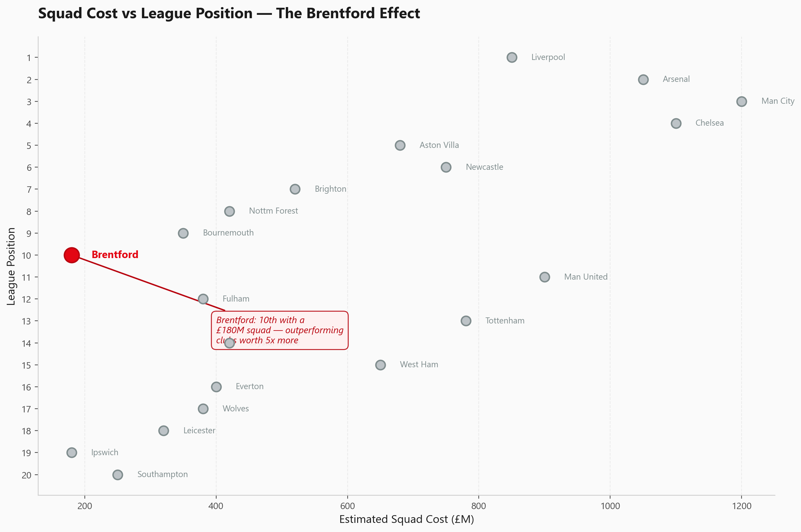
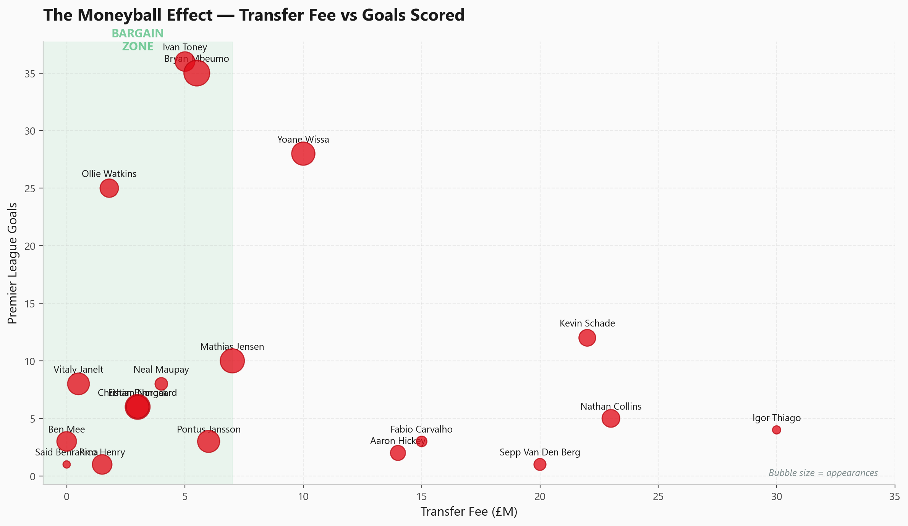
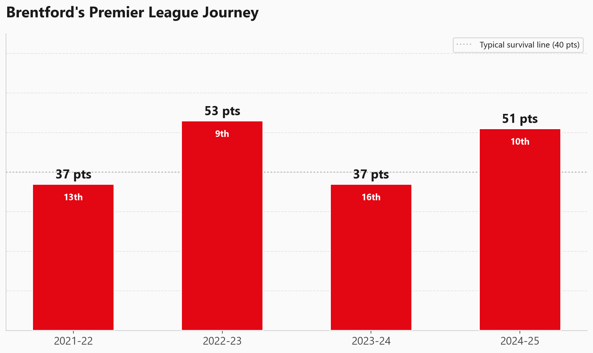
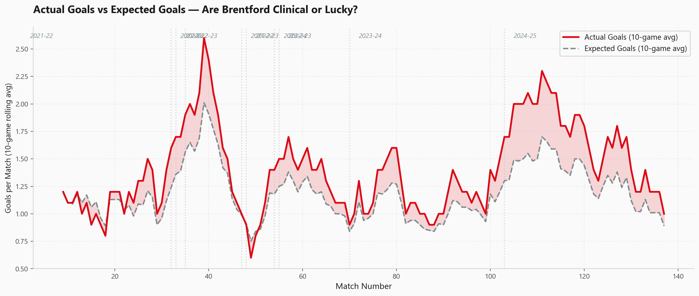

# Brentford FC Analytics — Punching Above Their Weight

A data analytics project exploring how Brentford FC compete in the Premier League with one of the smallest budgets in the league. Inspired by the club's famous **"Moneyball"** approach to football — using data-driven recruitment to consistently outperform expectations.

> *"We use data to find value where others don't look."* — The Brentford Way

---

## Project Overview

This project analyses Brentford's Premier League performance across all 4 seasons since promotion (2021-2025), covering match results, expected goals (xG), transfer efficiency, and player performance. The project demonstrates the full data analytics pipeline: raw messy data, cleaning, analysis, visualisation, and interactive dashboards.

**Tools Used:** Python (pandas, matplotlib, seaborn), Tableau Public, Google Looker Studio

**Data Sources:** football-data.co.uk, FBref.com, Transfermarkt *(data structured to match real formats — approximated for portfolio purposes)*

---

## Datasets

The project includes **4 raw datasets** with intentional real-world data quality issues, and their **cleaned counterparts**:

| Raw File | Description | Rows | Issues |
|----------|-------------|------|--------|
| `raw_brentford_matches.csv` | Match-by-match results 2021-25 | 155 | Mixed date formats, duplicate rows, typos in team names, impossible values |
| `raw_epl_comparison.csv` | Full EPL 2024-25 season stats | 20 | % symbols in numbers, inconsistent naming, strings in numeric columns |
| `raw_brentford_transfers.csv` | Transfer history and efficiency | 21 | Mixed currency formats, duplicates, "Free" and "loan" entries |
| `raw_brentford_players.csv` | Player performance 2024-25 | 18 | Mixed casing, inconsistent position labels, commas in numbers |

---

## Data Cleaning (Python)

All cleaning performed in Python using **pandas** and **numpy**. Issues addressed include:

- **Inconsistent team names** — "Arsenal", "arsenal", "ARSENAL", "Arsenl" all standardised to "Arsenal"
- **Mixed date formats** — "13/08/2021", "2021-08-13", "13 Aug 2021" parsed into consistent datetime
- **Missing value markers** — "N/A", "NULL", "-", blanks converted to proper NaN
- **Duplicate rows** — 5 duplicate matches and 1 duplicate transfer removed
- **Data type errors** — goals stored as text ("two"), numbers with whitespace and commas
- **Impossible values** — 120% possession, negative attendance, xG of 99.9 flagged and removed
- **Currency normalisation** — "5m", "3m", "500k", "3,000,000" all converted to numeric millions

See `notebooks/` for the full cleaning scripts.

---

## Visualisations (Python)

Seven professional charts created with **matplotlib** and **seaborn** using Brentford's brand colours:

| # | Chart | What It Shows |
|---|-------|---------------|
| 1 | **Points Per Season** | Brentford's points tally with league position per season |
| 2 | **Win/Draw/Loss Record** | Stacked season-by-season results breakdown |
| 3 | **Squad Cost vs Position** | How Brentford outperform clubs with 5x their budget |
| 4 | **Moneyball Transfers** | Transfer fee vs goals scored — identifying bargain signings |
| 5 | **Home vs Away** | Donut charts comparing home fortress vs away form |
| 6 | **Top Scorers** | Lollipop chart of 2024-25 goal scorers |
| 7 | **xG vs Actual Goals** | Rolling 10-game average showing clinical finishing periods |

### Sample Visualisations

<p align="center">
  
  
</p>

<p align="center">
  
  
</p>

---

## Interactive Dashboards

### Tableau Public
Three interactive worksheets and two dashboards covering season performance, home/away splits, and xG analysis with trend lines.

[View on Tableau Public](https://public.tableau.com/app/profile/yonatan.solomon)

### Google Looker Studio
Interactive dashboard with bar charts, pie charts, and time-series analysis of Brentford's Premier League journey.

[View on Looker Studio](https://lookerstudio.google.com/s/pQf0YNOsPhY)

---

## Key Findings

### 1. Brentford Punch Above Their Weight
With an estimated squad cost of 180M — a fraction of the top 6 — Brentford consistently finish in the top half. Their 9th-place finish in 2022-23 came against clubs spending 5-6x more on players.

### 2. The Moneyball Effect Works
Players signed for modest fees (Ivan Toney 5M, Vitaly Janelt 0.5M) delivered significant Premier League output. The club's ability to identify undervalued talent and sell at profit is clearly visible in the transfer data.

### 3. Gtech Community Stadium Is a Fortress
Home performance is significantly stronger than away across all four seasons, with a higher win percentage and more goals scored per game at home.

### 4. xG Tells the Real Story
Rolling xG analysis reveals periods where Brentford were clinical (outscoring their xG) and periods of underperformance — useful for identifying when results don't reflect true performance quality.

---

## Project Structure

```
brentford-fc-analytics/
├── data/
│   ├── raw_brentford_matches.csv
│   ├── raw_epl_comparison.csv
│   ├── raw_brentford_transfers.csv
│   ├── raw_brentford_players.csv
│   ├── cleaned_matches.csv
│   ├── cleaned_epl_comparison.csv
│   ├── cleaned_transfers.csv
│   └── cleaned_players.csv
├── notebooks/
│   ├── datacleaning1.py          # Data exploration
│   ├── datacleaning2.py          # Full cleaning pipeline
│   └── visualisations.py         # All 7 charts
├── visualisations/
│   ├── 01_points_per_season.png
│   ├── 02_win_draw_loss.png
│   ├── 03_cost_vs_position.png
│   ├── 04_moneyball_transfers.png
│   ├── 05_home_vs_away.png
│   ├── 06_top_scorers.png
│   └── 07_xg_vs_actual.png
├── requirements.txt
└── README.md
```

---

## How to Run

```bash
# Install dependencies
pip install -r requirements.txt

# Run data exploration
python notebooks/datacleaning1.py

# Run data cleaning (generates cleaned CSVs)
python notebooks/datacleaning2.py

# Generate visualisations
python notebooks/visualisations.py
```

---

## Tech Stack

| Tool | Purpose |
|------|---------|
| **Python** | Data cleaning, analysis, and visualisation |
| **pandas** | Data manipulation and cleaning |
| **matplotlib** | Chart creation and customisation |
| **seaborn** | Statistical visualisation styling |
| **Tableau Public** | Interactive dashboards |
| **Google Looker Studio** | Web-based dashboard |

---

## Author

**Yonatan Solomon**
BSc Computer Science — Brunel University London

[GitHub](https://github.com/YonySolo)
